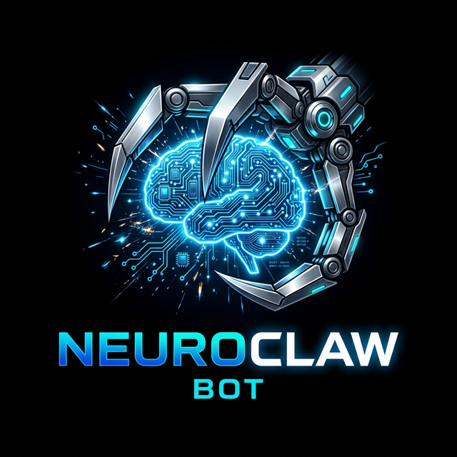

# NeuroClaw Bot

<p align="center">
  
</p>

<p align="center">
  <a href="https://www.python.org/downloads/"></a>
  <a href="LICENSE"></a>
  
  
  
</p>

<p align="center">
  <b>A fully local, autonomous AI coding agent — runs 100% offline on your laptop.</b><br>
  Inspired by Claude Code and OpenClaw. No API keys. No cloud. No data leaks.
</p>

---

## ✨ What is NeuroClaw Bot?

**NeuroClaw Bot** is an open-source autonomous coding agent that:

- 🖥️ Runs **entirely on your laptop** using GGUF models (no internet required)
- 🧠 Uses **two AI brains simultaneously** — Phi-3-mini (planner) + Qwen2.5-Coder-3B (coder)
- 📂 Automatically **scans and indexes your project** files on startup using RAG (FAISS)
- 🔧 Can **read, write, refactor, debug, and test** code autonomously
- 📱 Optionally connects to **Telegram** so you can control it from your phone

---

## 🏗️ Architecture

```
User (Terminal or Telegram Phone)
              │
        Request Router
              │
     ┌────────────────────┐
     │   Agent Loop       │  ← ReAct: Thought → Action → Observation → Repeat
     │  (NeuroClaw Bot)   │
     └────────┬───────────┘
              │
    ┌─────────┴──────────┐
    │                    │
🧠 Phi-3-mini        ⚙️ Qwen2.5-Coder-3B
  (Planner)              (Coder)
  Reasoning, Plans       Code writing, Edits, Debug
              │
        Tool Registry
   ├── read_file(path)
   ├── write_file(path, content)
   ├── list_files(directory)
   ├── search_code(query)
   └── run_terminal_command(cmd)
              │
    Project Files ↔ RAG Index (FAISS + sentence-transformers)
```

### Dual-Model Routing

| Model | Role | Used For |
|-------|------|----------|
| 🧠 **Phi-3-mini-4k-instruct** | Planner | Planning, reasoning, explaining, answering questions |
| ⚙️ **Qwen2.5-Coder-3B-Instruct** | Coder | Writing code, editing files, debugging, refactoring |

The router **automatically picks the right model** based on task keywords. No manual switching needed.

---

## 📁 Project Structure

```
neuroclaw-bot/
├── agent.py                   ← 🚀 Entry point — run this
├── setup_models.py            ← ⬇️  Downloads both models automatically
├── config.yaml                ← ⚙️  All settings
├── requirements.txt
├── assets/
│   └── logo.png               ← Project logo
├── models/                    ← 📦 Put your .gguf files here
│   └── README.md
├── core/
│   ├── agent_loop_dual.py     ← ReAct loop (dual-model, two-phase support)
│   └── memory.py              ← Sliding-window conversation memory
├── model/
│   ├── loader.py              ← Auto-detect + load any GGUF model
│   ├── model_router.py        ← Phi-3 vs Qwen-Coder routing logic
│   └── prompt_engine.py       ← Chat-format templates (Qwen/Phi/Llama)
├── tools/
│   └── registry.py            ← 5 built-in tools with safety sandboxing
├── rag/
│   └── indexer.py             ← FAISS vector index for project code
└── gateway/
    └── telegram_gateway.py    ← Optional Telegram remote control
```

---

## 🚀 Quick Start

### Step 1 — Clone

```bash
git clone https://github.com/0xSnipFiDev/NeuroClawBot.git
cd neuroclaw-bot
```

### Step 2 — Install dependencies

```bash
pip install -r requirements.txt
```

> **GPU support?** Replace the `llama-cpp-python` line in `requirements.txt` with:
> ```bash
> pip install llama-cpp-python --extra-index-url https://abetlen.github.io/llama-cpp-python/whl/cu121
> ```

### Step 3 — Download both AI models (~4.2 GB)

```bash
python setup_models.py
```

This downloads:
- `Phi-3-mini-4k-instruct-q4.gguf` (~2.2 GB) — Microsoft's reasoning model
- `qwen2.5-coder-3b-instruct-q4_k_m.gguf` (~2.0 GB) — Qwen's coding model

### Step 4 — Run inside any project

```bash
cd /path/to/your-project
python /path/to/neuroclaw-bot/agent.py
```

### Step 5 — Start coding!

```
You ▸ List all Python files in this project
You ▸ Add type hints to all functions in utils.py
You ▸ Run the tests and fix any failures
You ▸ Refactor the database module to use connection pooling
You ▸ Explain what main.py does
```

---

## 🎮 CLI Commands

| Command | Action |
|---------|--------|
| `quit` / `exit` | Exit the agent |
| `clear` | Clear conversation memory |
| `reindex` | Rebuild the project vector index |
| `models` | Show currently loaded models |
| `use coder` | Force next task to Qwen-Coder |
| `use planner` | Force next task to Phi-3 |

---

## ⚡ Advanced Options

```bash
# Enable GPU acceleration (set layers to offload)
python agent.py --gpu-layers 20

# Two-phase mode: Phi-3 plans, Qwen-Coder executes
python agent.py --two-phase

# Low-RAM mode: use only one model
python agent.py --single-model models/qwen2.5-coder-3b-instruct-q4_k_m.gguf

# Override specific model paths
python agent.py --coder-model /path/to/coder.gguf --planner-model /path/to/planner.gguf

# Force rebuild of the project index
python agent.py --rebuild-index

# Start Telegram remote control mode
python agent.py --telegram
```

---

## 📱 Telegram Remote Control

Control NeuroClaw Bot from your phone:

1. Create a bot: message **[@BotFather](https://t.me/BotFather)** → `/newbot` → copy TOKEN
2. Get your user ID: message **[@userinfobot](https://t.me/userinfobot)** → copy your ID
3. Edit `config.yaml`:

```yaml
telegram_token: "YOUR_BOT_TOKEN_HERE"
telegram_allowed_user_ids:
  - 123456789   # your Telegram user ID
```

4. Start:

```bash
python agent.py --telegram
```

Now send coding tasks to your bot from anywhere.

---

## 🔄 How the Agent Loop Works

NeuroClaw Bot uses the **ReAct** (Reasoning + Acting) pattern:

```
User Task
   │
[RAG retrieves relevant code snippets from your project]
   │
🧠 Thought: "I need to read main.py first to understand the bug."
⚙️ Action: read_file
   Input:  {"path": "main.py"}
   Output: [file contents shown]
   │
🧠 Thought: "I can see the null-check is missing on line 42. I'll fix it."
⚙️ Action: write_file
   Input:  {"path": "main.py", "content": "...fixed code..."}
   Output: [OK] Written 892 chars to main.py
   │
🧠 Thought: "Let me run the tests to verify the fix works."
⚙️ Action: run_terminal_command
   Input:  {"command": "python -m pytest tests/ -v"}
   Output: 5 passed in 1.23s
   │
✅ Final Answer: Fixed the null-check bug in main.py line 42.
                 All 5 tests now pass.
```

---

## 💻 System Requirements

| Component | Minimum | Recommended |
|-----------|---------|-------------|
| RAM | 8 GB (single model) | 16 GB (dual model) |
| Disk | 6 GB free | 10 GB free |
| Python | 3.10+ | 3.11+ |
| GPU | Not required | CUDA/ROCm/Metal (optional) |
| OS | Windows / macOS / Linux | Any |

---

## 🤖 Supported Models

Any `.gguf` file works. Top recommendations:

| Model | File Size | Best For |
|-------|-----------|----------|
| Qwen2.5-Coder-3B-Instruct-Q4_K_M ⭐ | 2.0 GB | Default coder (8 GB RAM) |
| Phi-3-mini-4k-instruct-Q4 ⭐ | 2.2 GB | Default planner (8 GB RAM) |
| Qwen2.5-Coder-7B-Instruct-Q4_K_M | 4.5 GB | Better code quality (16 GB) |
| DeepSeek-Coder-6.7B-Instruct-Q4_K_M | 4.1 GB | Excellent reasoning (16 GB) |
| CodeLlama-7B-Instruct-Q4_K_M | 4.0 GB | Alternative coder (16 GB) |

### Manual Download (alternative to setup_models.py)

```bash
pip install huggingface-hub

# Qwen Coder (coder model)
huggingface-cli download Qwen/Qwen2.5-Coder-3B-Instruct-GGUF \
    qwen2.5-coder-3b-instruct-q4_k_m.gguf --local-dir ./models

# Phi-3-mini (planner model)
huggingface-cli download microsoft/Phi-3-mini-4k-instruct-gguf \
    Phi-3-mini-4k-instruct-q4.gguf --local-dir ./models
```

---

## 🔒 Privacy & Security

- ✅ **100% offline** — no data ever sent to any server
- ✅ **Path sandboxing** — tools cannot read/write outside your project directory
- ✅ **Command safety** — dangerous shell commands automatically blocked
- ✅ **Telegram allowlist** — only your user ID can control the bot

---

## 🛠️ Configuration (`config.yaml`)

```yaml
# Models
coder_model: "models/qwen2.5-coder-3b-instruct-q4_k_m.gguf"
coder_ctx: 4096
planner_model: "models/Phi-3-mini-4k-instruct-q4.gguf"
planner_ctx: 4096

# GPU: 0=CPU only, 20-35=partial GPU, -1=all GPU
n_gpu_layers: 0

# Agent
max_iterations: 12

# RAG
top_k_retrieval: 3
embedding_model: all-MiniLM-L6-v2

# Telegram (optional)
# telegram_token: "YOUR_BOT_TOKEN"
# telegram_allowed_user_ids:
#   - 123456789
```

---

## 🤝 Contributing

Contributions are welcome! Areas to work on:

- 🔧 New tools (`git_commit`, `create_tests`, `lint_code`)
- 🌐 Web dashboard UI
- 💬 More gateway channels (Discord, WhatsApp, Slack)
- 🧪 Better test coverage
- 📖 Documentation improvements

---

## 📄 License

This project is licensed under the **MIT License** — see [LICENSE](LICENSE) for details.

---

## 🙏 Acknowledgements

- [llama-cpp-python](https://github.com/abetlen/llama-cpp-python) — local GGUF inference engine
- [sentence-transformers](https://www.sbert.net/) — code embeddings for RAG
- [FAISS](https://github.com/facebookresearch/faiss) — fast vector similarity search
- [Claude Code](https://github.com/anthropics/claude-code) — tool-call architecture inspiration
- [OpenClaw](https://github.com/openclaw/openclaw) — multi-channel gateway concept
- [python-telegram-bot](https://github.com/python-telegram-bot/python-telegram-bot) — Telegram integration

---

<p align="center">
  
  <br><br>
  <b>NeuroClaw Bot</b> — Your AI coding assistant, running entirely on your machine.<br>
  Made with ❤️ for developers who value privacy and ownership.
</p>
